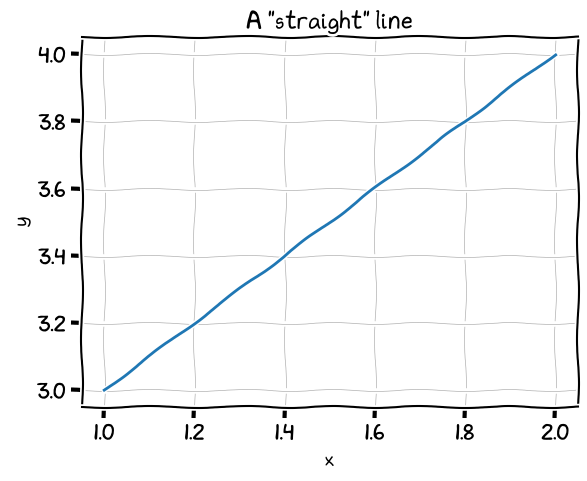

# Fonts for using `plt.xkcd`

The following resources contain the fonts necessary to use `plt.xkcd`
([this](https://stackoverflow.com/a/22812176) answer helped me find them). For my
convenience I have gathered them in the `fonts` directory -- please let me know
if this contradicts a license I am not aware of.

+ `xkcd` and `xkcd-script` are taken from [here](https://github.com/ipython/xkcd-font)
+ `humor` is taken from [here](https://github.com/shreyankg/xkcd-desktop/blob/master/Humor-Sans.ttf)
+ `comic-sans-ms` is taken from [here](https://www.wfonts.com/font/comic-sans-ms)
+ `comic-neue` is taken from [here](https://fonts.google.com/specimen/Comic+Neue)

## Install

### Fedora

+ `make fedora-install-fonts`
  + copy the contents of the `fonts` directory in `~/.local/share/fonts`
  + run `fc-cache -v` (then `fc-list | grep xkcd` to check installation)
  + clear matplotlib's cache

### Macos

+ drag and drop the `fonts` folder in the `Font Book` application (no need to replace
  already existing fonts)
+ you might have to clears matplotlib's cache (`~/.matplotlib/fontlist-v330.json`)

## Create test plot

+ `make test-plot`

